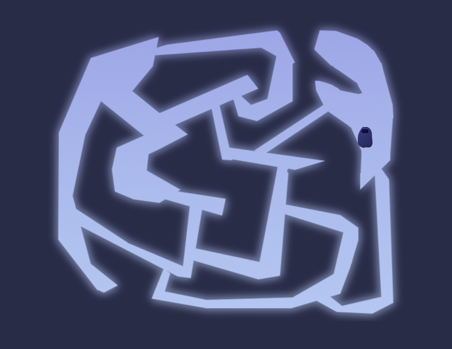

# Navigation Polygon 2D

Example of using 2D navigation using:
- [`NavigationRegion2D`](https://docs.godotengine.org/en/latest/classes/class_navigationregion2d.html)
- [`NavigationPolygon`](https://docs.godotengine.org/en/latest/classes/class_navigationpolygon.html)
- [`NavigationAgent2D`](https://docs.godotengine.org/en/latest/classes/class_navigationagent2d.html)

Language: GDScript

Renderer: Compatibility

Check out this demo on the asset library: https://godotengine.org/asset-library/asset/117

## Screenshots

# Assets:
Map: [Minimap Pack - Kenny](https://kenney.nl/assets/minimap-pack)
UI sprites: [UI Pack - Adventure](https://kenney.nl/assets/ui-pack-adventure)
Mouse and rat: [Craftpix - free street animal asset pack](https://craftpix.net/freebies/free-street-animal-pixel-art-asset-pack/?num=1&count=1082&sq=rat&pos=4)
Cheese: [Cheese / Anti-Pasto Platter Animated Pixel Pack Sprites (16 items x 4 Frames) - Power Up Your Game Fast!](https://cheddagames.itch.io/cheese-platter-pixel-pack)
Menu music: [8 Bit dungeon - Kaden_Cook](https://pixabay.com/music/video-games-8-bit-dungeon-251388/)
Background music: [Dungeon Level upbeat power music](https://pixabay.com/music/video-games-dungeon-level-upbeat-power-music-160-bpm-293383/)
Menu Background Image: [Dark medieval dungeon with stone artwork for game](https://www.freepik.com/free-vector/dark-medieval-dungeon-with-stone-wall-game_402018670.htm#fromView=keyword&page=1&position=1&uuid=63f3891c-61f2-41bb-8d06-02dcaa443a95&query=Dungeon)
Mardown Label Godot: [MarkdownLabel](https://godotengine.org/asset-library/asset/2302)
